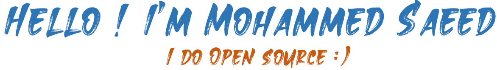

> I am a passionate and wants to be a good full stack developer

## About me
- 🌱 I’m currently learning MERN Stack and Java.
- 💬 Ask me about [here](https://github.com/myselfnovice/myselfnovice/issues)
- 📫 You can connect with me on [Twitter](https://www.twitter.com/Hey_Novice) and [LinkedIn](https://www.linkedin.com/in/mohdsaeed).
 

## Tools and Technologies

## Statistics
|  |  |
| ------------- | ------------- |
 

## Top Repositories

## Recent ...

<!--
**myselfnovice/myselfnovice** is a ✨ _special_ ✨ repository because its `README.md` (this file) appears on your GitHub profile.

Here are some ideas to get you started:

- 🔭 I’m currently working on ...
- 🌱 I’m currently learning ...
- 👯 I’m looking to collaborate on ...
- 🤔 I’m looking for help with ...
- 💬 Ask me about 
- 📫 How to reach me: ...
- 😄 Pronouns: ...
- ⚡ Fun fact: ...
-->
